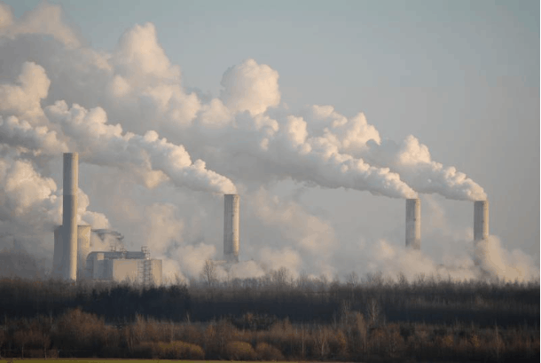

```{r global_options, echo=FALSE}
knitr::opts_chunk$set(fig.height=3, fig.width=5, warning=FALSE, tidy=TRUE, tidy.opts=list(width.cutoff=60))
```

```{r include=FALSE}
emissions <- read.csv('Project1_emissions.csv')
library(ggplot2)
library(tidyverse)
```


## **Introduction**
The modern issue of climate change is a subject worth noting as our planet has been undoubtedly warming up since the industrial revolution. In an article titled "CO2 and Greenhouse Emissions" by Ritchie, Roser, and Rosado, CO2 emissions are heavily correlated with the changes in the global climate and also linked to "extreme weather events" around the world such as floods and heatwaves. (To learn more, click [here](https://ourworldindata.org/co2-and-greenhouse-gas-emissions#citation)).

To explore some of the key contributors to CO2 emissions, we will examine a data set containing emissions data from 92 countries in 2018. This data set was gathered by *Our World in Data* from various sources such as the Global Carbon Project and the U.S. Energy Information Administration. This data set introduces variables such as a country's region, GDP, population, N2O production, and CO2 production.

In this study, we will use these variables to predict which regions and countries are playing the key role in climate change (we will measure impact climate change by the country's CO2 production), and we'll also discover whether GDP and population sizes are predictors of CO2 production by looking at correlation.



*Image Source:https://cei.org/studies/a-policy-makers-guide-to-climate-change/*

# Heavy CO2 Production is Attributed to Only a Select Few of Countries

```{r echo=FALSE}
df <- ggplot(emissions)
df + geom_histogram(aes(x = CO2_Produced), col = 'black', fill = 'lightblue', binwidth = 1000) +
labs(x='CO2 Production (kilotons)', y ='Number of Countries') + theme_classic()

summary(emissions$CO2_Produced)
```

Presented above is a histogram of CO2 production across our data set of countries. This plot displays how many countries fall into a certain range of CO2 production.

As we can see, the histogram of CO2 production results in a skewed right distribution meaning that most countries in our data set fell in the lower ranges of CO2 production. Since this plot is skewed, we must use the median value to obtain a better understanding of the central value. The median value is `r round(median(emissions$CO2_Produced),3)` kilotons of CO2. We can also use the standard deviation to get an idea of the spread. The standard deviation is `r round(sd(emissions$CO2_Produced),3)` kilotons of CO2.

The standard deviation is rather high and the median value is quite low for this distribution. This high spread and low median suggests the idea that only a select few countries are the key contributors to high CO2 production, and thus have contributed the most to heightened climate change.
```{r echo=FALSE}
emissions[emissions$CO2_Produced == '10289.989',]
emissions[emissions$CO2_Produced == '5375.491',]
```

>**The outlier country that lies in the highest part of the distribution is China and the second highest is the United States. This observation proposes a question: What region is contributing the most to climate change?** 

## **Regional Differences in CO2 Production**

```{r echo=FALSE}
df + geom_boxplot(aes(x = Region, y = CO2_Produced, color = Region)) +  labs(x = 'Region', y = 'CO2 Production (kilotons)')
```

The box plot shown above introduces the region variable (countries are now split into their respective regions), so we can identify the region that contributes to climate change the most.

### Median Values in CO2 Production (kilotons)
```{r echo=FALSE}
aggregate(CO2_Produced~Region, data = emissions, median)
```


**As we can see above, by comparing the median values for CO2 production, we can see that the Asia/Pacific region produces the most with its median value of 276.177 kilotons of CO2. It is followed by the Americas (84.881 kilotons) and the Middle East (78.096 kilotons). Therefore, these three regions are the key contributors linked to climate change.** 

**It is also worth noting to pay attention to the outliers presented in the chart. China, as we identified before, sits at the top of the Asia/Pacific region followed by India right under. The U.S. is the outlier sitting on top of the Americas category. **

**These countries are among most populous and have the strongest economies in the world, so naturally we should investigate if population and economic strength is a contributor to higher CO2 production numbers.**

## **Economic Growth of a Country vs. CO2 Production**

```{r echo=FALSE, message=FALSE, warning=FALSE}
df + geom_point(aes(x = GDP, y = CO2_Produced), col = 'violet') + labs( x = 'Gross Domestic Product (GDP)', y = 'CO2 Produced (kilotons)') + geom_smooth(aes(x = GDP, y = CO2_Produced), method = 'lm', se = FALSE)
```
```{r include=FALSE}
round(cor(emissions$CO2_Produced, emissions$GDP),3)
```
The scatter plot shown is a plot between a country's GDP and the CO2 produced. We observe a rather strong positive correlation between the two variables visually. The r-value, .936, confirms this. It's close to 1 which indicates a strong, positive correlation between the two. Correlation does not imply causation, but there must be a factor that is linking the two variables together.

We can draw an idea that a country's economical strength is likely a key contributor to climate change. This could be explained by relatively higher production, shipment, and other factors compared to countries with lower GDP.

## **Population of a Country vs. CO2 Production**

```{r echo=FALSE, message=FALSE, warning=FALSE}
df + geom_point(aes(x = Population, y = CO2_Produced), col = 'orange') + labs( x = 'Population', y = 'CO2 Produced (kilotons)') + geom_smooth(aes(x = Population, y = CO2_Produced), method = 'lm', se = FALSE)
```
```{r include=FALSE}
round(cor(emissions$CO2_Produced, emissions$Population),3)
```
Next, we look at population vs. CO2 production. Again, the scatter plot, visually, shows a strong positive correlation between the two variables, and the r-value also indicates this with a value of .814.

Like GDP, we can also draw the idea that population could be one of the key contributors to CO2 production in some way. Although this is the case, population is a vague representation of what is the real underlying reason for why more populated countries produce more CO2. The existence of people does not cause CO2 levels to rise. There could be more emissions because of the number of cars driven on the road for example. Our data set doesn't contain this, so we won't go further into this in our study.

# **Summary**
In conclusion, with our 2018 data set of 92 countries depicting CO2 emissions, we have discovered that the major regional contributor to climate change is the Asia/Pacific region. In addition, we found that the countries that produced the most CO2 overall were China, the U.S., and India. Finally, we also saw that there was a strong positive correlation between a country's GDP and population to that of CO2 production in 2018. This indicates that there may be some relation between the variables. However, it is important to recognize that these correlations between GDP and population to CO2 production does not mean causation. This data set only gave us a general idea of the key contributors to climate change and gives us a field to narrow down some of the factors. In future research, it is advisable to look at smaller factors inside the workings of population and GDP such as number of cars owned in each country (emissions are higher with more cars running), and amount of manufacturing plants.

---
### Sources:
• Hannah Ritchie, Max Roser and Pablo Rosado (2020) - "CO₂ and Greenhouse Gas Emissions". Published online at OurWorldInData.org. Retrieved from: 'https://ourworldindata.org/co2-and-greenhouse-gas-emissions' [Online Resource]

Image:https://cei.org/studies/a-policy-makers-guide-to-climate-change/

Data Set: https://corgis-edu.github.io/corgis/csv/global_emissions/
